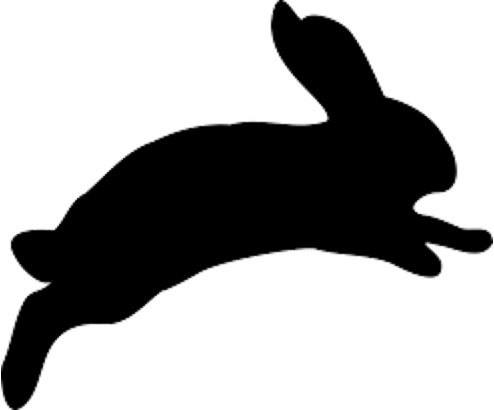

# Invasive Species Costs in Australia

R Code and data to calculate costs of invasive species in Australia

(updated January 2021)

Corey J. A. Bradshaw,
Global Ecology,
Flinders University

<strong>URL</strong>: http://GlobalEcologyFlinders.com  
<a href="mailto:corey.bradshaw@flinders.edu.au">e-mail</a>

Accompanies paper:

<a href="http://www.flinders.edu.au/people/corey.bradshaw">Bradshaw, CJA</a>, <a href="https://people.csiro.au/H/A/Andrew-Hoskins">AJ Hoskins</a>, <a href="https://scholar.google.com/citations?hl=de&user=fwHUGm0AAAAJ&view_op=list_works&sortby=pubdate">PJ Haubrock</a>, <a href="https://www.rosscuthbert.org">RN Cuthbert</a>, <a href="https://www.ese.universite-paris-saclay.fr/en/team-members/christophe-diagne/">C Diagne</a>, <a href="https://borisleroy.com">B Leroy</a>, <a href="https://www.linkedin.com/in/lindell-andrews-51bb59105/?originalSubdomain=au">L Andrews</a>, <a href="https://invasives.com.au/news-events/introducing-the-people-of-ciss-dr-brad-page/">B Page</a>, <a href="http://www.cassey-invasion-ecology.org/people.html">P Cassey</a>, <a href="https://people.csiro.au/S/A/Andy-Sheppard">AW Sheppard</a>, <a href="http://max2.ese.u-psud.fr/epc/conservation/pages/Franck/homepage.html">F Courchamp</a>. 2021. <a href="https://doi.org/10.3897/neobiota.67.58834">Detailed assessment of the reported economic costs of invasive species in Australia</a>. <i>NeoBiota</i> 67: 511–550. doi:10.3897/neobiota.67.58834

requires the following packages from the <a href="https://cran.r-project.org">CRAN</a>
- <a href="https://cran.r-project.org/web/packages/sandwich/index.html"><code>sandwich</code></a>
- <a href="https://cran.r-project.org/web/packages/ggalluvial/index.html"><code>ggalluvial</code></a>
- <a href="https://cran.r-project.org/web/packages/lmtest/index.html"><code>lmtest</code></a>
- <a href="https://cran.r-project.org/web/packages/robustbase/index.html"><code>robustbase</code></a>
- <a href="https://cran.r-project.org/web/packages/ggplot2/index.html"><code>ggplot2</code></a>
- <a href="https://cran.r-project.org/web/packages/ggpubr/index.html"><code>ggpubr</code></a>
- <a href="https://cran.r-project.org/web/packages/plyr/index.html"><code>plyr</code></a>
- <a href="https://cran.r-project.org/web/packages/dplyr/index.html"><code>dplyr</code></a>
- <a href="https://cran.r-project.org/web/packages/grid/index.html"><code>grid</code></a>
- <code>invacost</code> (obtained from <a href="mailto:leroy.boris@gmail.com">Boris Leroy</a>; pre-print <a href="http://doi.org/10.1101/2020.12.10.419432">here</a>)

requires the following filtered dataset for Australia
- <a href="https://github.com/cjabradshaw/InvasiveSppCostsAustralia/blob/master/AustraliaUpdate3.csv">AustraliaUpdate3.csv</a>

see also original InvaCost database publication:
-  Diagne C, Leroy B, Gozlan RE, Vaissière A-C, Assailly C, Nuninger L, Roiz D, Jourdain F, Jarić I, Courchamp F (2020) InvaCost, a public database of the economic costs of biological invasions worldwide. <em>Scientific Data</em> 7: 277. doi:<a href="http://doi.org/10.1038/s41597-020-00586-z">10.1038/s41597-020-00586-z</a>

- Diagne C, Catford JA, Essl F, Nuñez MA, Courchamp F (2020a) What are the economic costs of biological invasions? A complex topic requiring international and interdisciplinary expertise. <em>NeoBiota</em> 63: 25-37. doi:<a href="http://doi.org/10.3897/neobiota.63.55260">10.3897/neobiota.63.55260</a>

as well as this paper in <i>Nature</i>:
- Diagne C, Leroy B, Vaissière A-C, Gozlan RE, Roiz D, Jarić I, Salles J-M, Bradshaw CJA, Courchamp F (2021) <a href="http://doi.org/10.1038/s41586-021-03405-6">High and rising economic costs of biological invasions worldwide</a>. <em>Nature</em> 592: 571-576. doi:10.1038/s41586-021-03405-6

## ENDNOTE LIBRARIES
Also included are two versions of an Endnote library containing the source references for the database
- <a href="https://github.com/cjabradshaw/InvasiveSppCostsAustralia/blob/master/AustraliaCostsInvasiveSppEndnote.enlx">AustraliaCostsInvasiveSppEndnote.enlx</a> (Endnote compressed library)
- <a href="https://github.com/cjabradshaw/InvasiveSppCostsAustralia/blob/master/AustraliaCostsInvasiveSppEndnote.zip">AustraliaCostsInvasiveSppEndnote.zip</a> (zipped Endnote .enl file and data)

