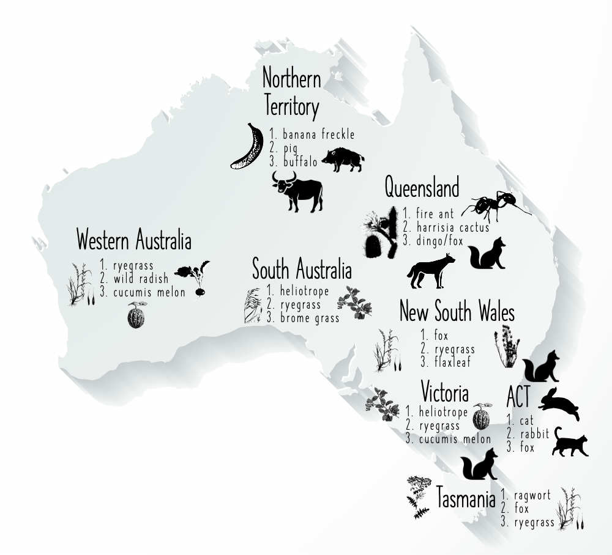

# Invasive Species Costs in Australia

R Code and data to calculate costs of invasive species in Australia

(updated January 2021)

Corey J. A. Bradshaw,
Global Ecology,
Flinders University

<strong>URL</strong>: http://GlobalEcologyFlinders.com  
<a href="mailto:corey.bradshaw@flinders.edu.au">e-mail</a>

Accompanies paper:

<a href="http://www.flinders.edu.au/people/corey.bradshaw">Bradshaw, CJA</a>, <a href="https://people.csiro.au/H/A/Andrew-Hoskins">AJ Hoskins</a>, <a href="https://scholar.google.com/citations?hl=de&user=fwHUGm0AAAAJ&view_op=list_works&sortby=pubdate">PJ Haubrock</a>, <a href="https://www.rosscuthbert.org">RN Cuthbert</a>, <a href="https://www.ese.universite-paris-saclay.fr/en/team-members/christophe-diagne/">C Diagne</a>, <a href="https://borisleroy.com">B Leroy</a>, <a href="https://www.linkedin.com/in/lindell-andrews-51bb59105/?originalSubdomain=au">L Andrews</a>, <a href="https://invasives.com.au/news-events/introducing-the-people-of-ciss-dr-brad-page/">B Page</a>, <a href="http://www.cassey-invasion-ecology.org/people.html">P Cassey</a>, <a href="https://people.csiro.au/S/A/Andy-Sheppard">AW Sheppard</a>, <a href="http://max2.ese.u-psud.fr/epc/conservation/pages/Franck/homepage.html">F Courchamp</a>. 2021. <a href="https://doi.org/10.3897/neobiota.67.58834">Detailed assessment of the reported economic costs of invasive species in Australia</a>. <i>NeoBiota</i> 67: 511–550. doi:10.3897/neobiota.67.58834

## Abstract
The legacy of deliberate and accidental introductions of invasive alien species to Australia has had a hefty economic toll, yet quantifying the magnitude of the costs associated with direct loss and damage, as well as for management interventions, remains elusive. This is because the reliability of cost estimates and under-sampling have not been determined. We provide the first detailed analysis of the reported costs associated with invasive species to the Australian economy since the 1960s, based on the recently published InvaCost database and supplementary information, for a total of 2078 unique cost entries. Since the 1960s, Australia has spent or incurred losses totalling at least US$298.58 billion (2017 value) or AU$389.59 billion (2017 average exchange rate) from invasive species. However, this is an underestimate given that costs rise as the number of estimates increases following a power law. There was an average 1.8–6.3-fold increase in the total costs per decade since the 1970s to the present, producing estimated costs of US$6.09–57.91 billion year-1 (all costs combined) or US$225.31 million–6.84 billion year-1 (observed, highly reliable costs only). Costs arising from plant species were the highest among kingdoms (US$151.68 billion), although most of the costs were not attributable to single species. Of the identified weedy species, the costliest were <a href="https://www.agric.wa.gov.au/grains-research-development/annual-ryegrass?nopaging=1">annual ryegrass</a> (<em>Lolium rigidum</em>), <a href="https://www.business.qld.gov.au/industries/farms-fishing-forestry/agriculture/land-management/health-pests-weeds-diseases/weeds-diseases/invasive-plants/restricted/parthenium">parthenium</a> (<em>Parthenium hysterophorus</em>) and <a href="https://weeds.dpi.nsw.gov.au/Weeds/Ragwort">ragwort</a> (<em>Senecio jacobaea</em>). The four costliest classes were mammals (US$48.63 billion), insects (US$11.95 billion), eudicots (US$4.10 billion) and monocots (US$1.92 billion). The three costliest species were all animals — <a href="https://www.environment.gov.au/biodiversity/invasive-species/feral-animals-australia/feral-cats">cats</a> (<em>Felis catus</em>), <a href="https://www.rabbitfreeaustralia.org.au/rabbits/the-rabbit-problem/">rabbits</a> (<em>Oryctolagus cuniculus</em>) and <a href="https://www.environment.gov.au/biodiversity/invasive-species/insects-and-other-invertebrates/tramp-ants/red-imported-fire">red imported fire ants</a> (<em>Solenopsis invicta</em>). Each State/Territory had a different suite of major costs by species, but with most (3–62%) costs derived from one to three species per political unit. Most (61%) of the reported costs applied to multiple environments and 73% of the total pertained to direct damage or loss compared to management costs only, with both of these findings reflecting the availability of data. Rising incursions of invasive species will continue to have substantial costs for the Australian economy, but with better investment, standardised assessments and reporting and coordinated interventions (including eradications), some of these costs could be substantially reduced.

 

## Requires the following packages from the <a href="https://cran.r-project.org">CRAN</a>
- <a href="https://cran.r-project.org/web/packages/sandwich/index.html"><code>sandwich</code></a>
- <a href="https://cran.r-project.org/web/packages/ggalluvial/index.html"><code>ggalluvial</code></a>
- <a href="https://cran.r-project.org/web/packages/lmtest/index.html"><code>lmtest</code></a>
- <a href="https://cran.r-project.org/web/packages/robustbase/index.html"><code>robustbase</code></a>
- <a href="https://cran.r-project.org/web/packages/ggplot2/index.html"><code>ggplot2</code></a>
- <a href="https://cran.r-project.org/web/packages/ggpubr/index.html"><code>ggpubr</code></a>
- <a href="https://cran.r-project.org/web/packages/plyr/index.html"><code>plyr</code></a>
- <a href="https://cran.r-project.org/web/packages/dplyr/index.html"><code>dplyr</code></a>
- <a href="https://cran.r-project.org/web/packages/grid/index.html"><code>grid</code></a>
- <a href="https://github.com/cjabradshaw/invacost"><code>invacost</code></a>

## Requires the following filtered dataset for Australia
- <a href="https://github.com/cjabradshaw/InvasiveSppCostsAustralia/blob/master/AustraliaUpdate3.csv">AustraliaUpdate3.csv</a> (NOTE: this dataset is based mainly on the <a href="https://github.com/cjabradshaw/invacost"><em>InvaCost</em> database</a>, which is an evolving, '<a href="https://borisleroy.com/invacost/invacost_livingfigure.html">living</a>' database updated regularly; this means that the estimated costs for Australia are probably already out-of-date)

## See also original <em>InvaCost</em> database publication:
-  Diagne C, Leroy B, Gozlan RE, Vaissière A-C, Assailly C, Nuninger L, Roiz D, Jourdain F, Jarić I, Courchamp F (2020) InvaCost, a public database of the economic costs of biological invasions worldwide. <em>Scientific Data</em> 7: 277. doi:<a href="http://doi.org/10.1038/s41597-020-00586-z">10.1038/s41597-020-00586-z</a>

- Diagne C, Catford JA, Essl F, Nuñez MA, Courchamp F (2020a) What are the economic costs of biological invasions? A complex topic requiring international and interdisciplinary expertise. <em>NeoBiota</em> 63: 25-37. doi:<a href="http://doi.org/10.3897/neobiota.63.55260">10.3897/neobiota.63.55260</a>

as well as this paper in <i>Nature</i>:
- Diagne C, Leroy B, Vaissière A-C, Gozlan RE, Roiz D, Jarić I, Salles J-M, Bradshaw CJA, Courchamp F (2021) <a href="http://doi.org/10.1038/s41586-021-03405-6">High and rising economic costs of biological invasions worldwide</a>. <em>Nature</em> 592: 571-576. doi:10.1038/s41586-021-03405-6

## ENDNOTE libraries
Also included are two versions of an Endnote library containing the source references for the database
- <a href="https://github.com/cjabradshaw/InvasiveSppCostsAustralia/blob/master/AustraliaCostsInvasiveSppEndnote.enlx">AustraliaCostsInvasiveSppEndnote.enlx</a> (Endnote compressed library)
- <a href="https://github.com/cjabradshaw/InvasiveSppCostsAustralia/blob/master/AustraliaCostsInvasiveSppEndnote.zip">AustraliaCostsInvasiveSppEndnote.zip</a> (zipped Endnote .enl file and data)

